  

### What I build.

**Analytics & ML.** Models that turn customer data into a business decision: churn, lifetime value, recommendation.
Python · scikit-learn · statsmodels · calibration · expected-value modeling

**Data engineering.** Pipelines from raw sources to analytics-ready tables.
SQL · PySpark · Snowflake · GCP (Dataproc, GCS) · Tableau

**LLM systems.** Multi-agent pipelines with structured outputs and deterministic checks around the model.
Claude API · multi-agent orchestration · prompt design

**Markets.** Macro and sector research tools built for portfolio conversations.
OECD and FRED data · regime modeling · factor analysis

---

Los Angeles · [Email](mailto:hansonyang813@gmail.com) · [LinkedIn](https://www.linkedin.com/in/hansony)
